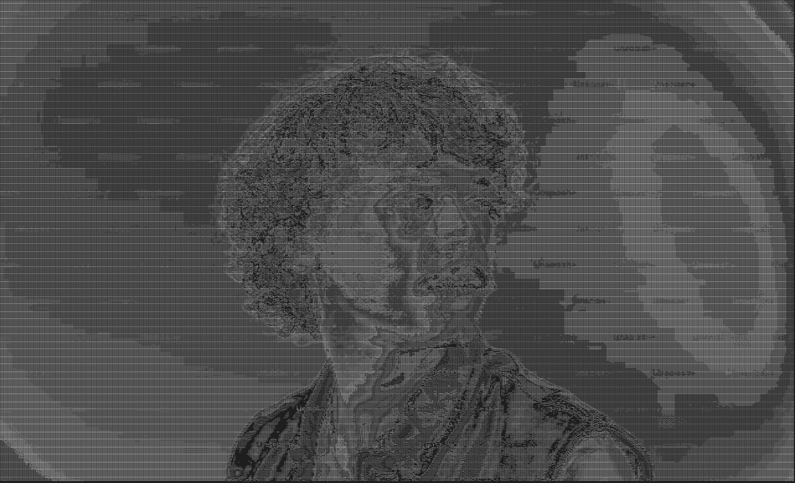
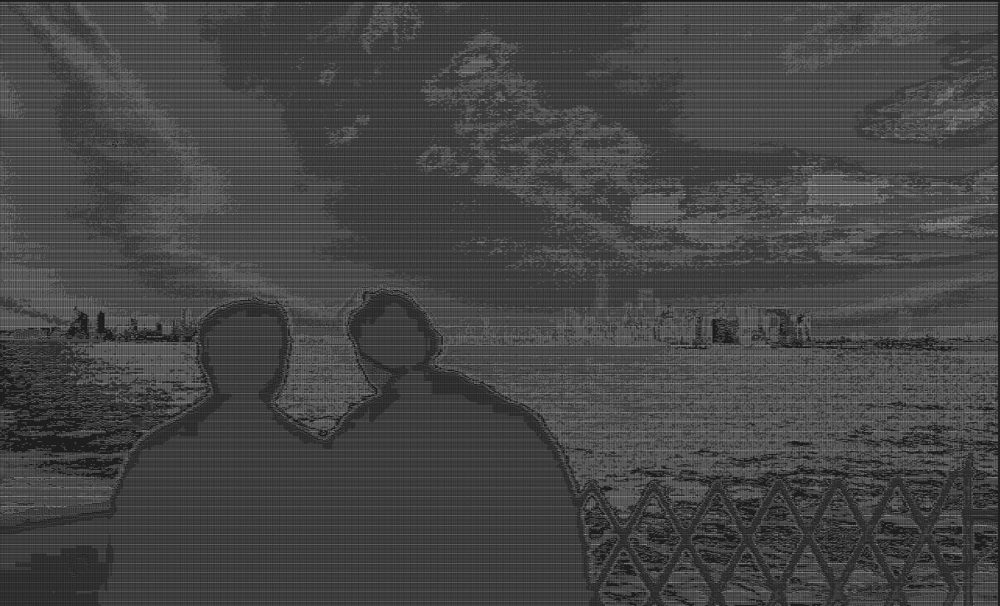

# Image to ASCII Converter

This Java project converts an image file into an ASCII representation based on the brightness of each pixel. It reads an image, calculates the brightness, and then maps each pixel's brightness to a corresponding ASCII character.

## Requirements

Before you can run this program, you must have Java installed on your system.

1. **Install Java Development Kit (JDK)**:
    - Download and install the JDK from the official Oracle website: [JDK Download](https://www.oracle.com/java/technologies/javase-downloads.html).
    - Follow the instructions for your operating system to install Java.
    - Once installed, verify Java is working by running the following command in your terminal/command prompt:
        ```bash
        java -version
        ```

## Setup Instructions

1. **Clone or Download the Project**:
    - Download the project files to your local machine or clone the repository (if applicable).

2. **Compile the Java Files**:
    - Open a terminal or command prompt in the directory containing your project files.
    - Compile the Java files using the following command:
        ```bash
        javac *.java
        ```

3. **Run the Program**:
    - After compiling the Java files, you can run the program with:
        ```bash
        java App > output-file-name.txt
        ```
      Replace `output-file-name.txt` with your desired output file name.

4. **View the Output**:
    - The output of the ASCII conversion will be saved in a text file (e.g., `output-file-name.txt`).
    - To view the output, I recommend to use the Notepads app available in the Microsoft Store. You can download it from this link:
      [Notepads - Microsoft Store](https://apps.microsoft.com/detail/9NHL4NSC67WM?hl=pt-br&gl=BR&ocid=pdpshare).

## Examples

You can use the images below as examples of output images from the ASCII conversion.

1. **Example 1:**
    - 

2. **Example 2:**
    - 

## How It Works

- The program first loads an image file from a specified path.
- It then extracts the RGB values of each pixel and calculates its brightness.
- Using the brightness, it maps each pixel to a character from an ASCII scale, creating an ASCII art version of the image.

The ASCII characters are chosen based on the brightness values, where lighter pixels are mapped to more complex characters, and darker pixels are mapped to simpler ones.

## Note

For the best results, images should ideally be in a resolution of **640x480** pixels.
